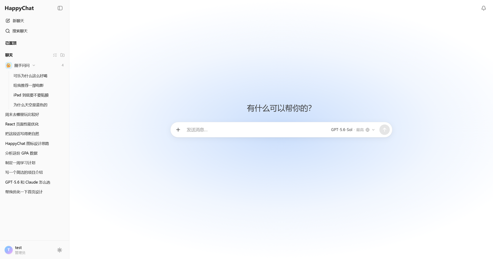
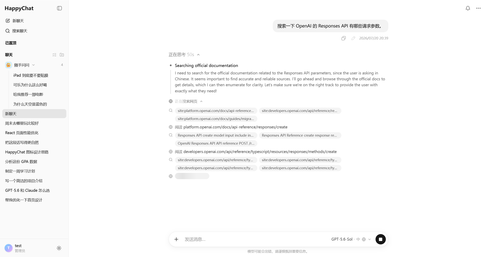
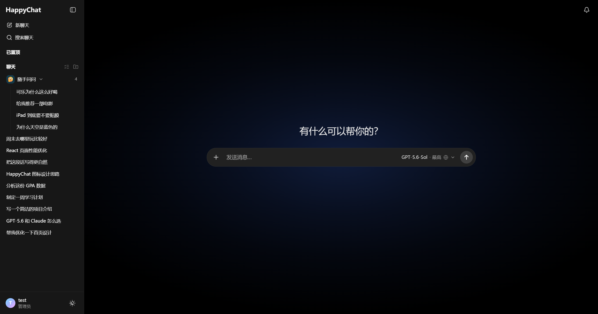
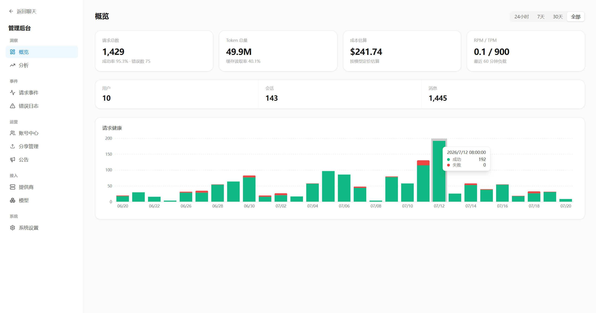
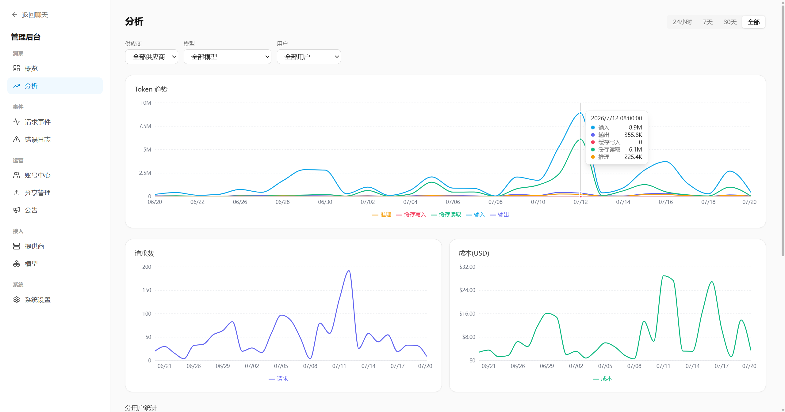
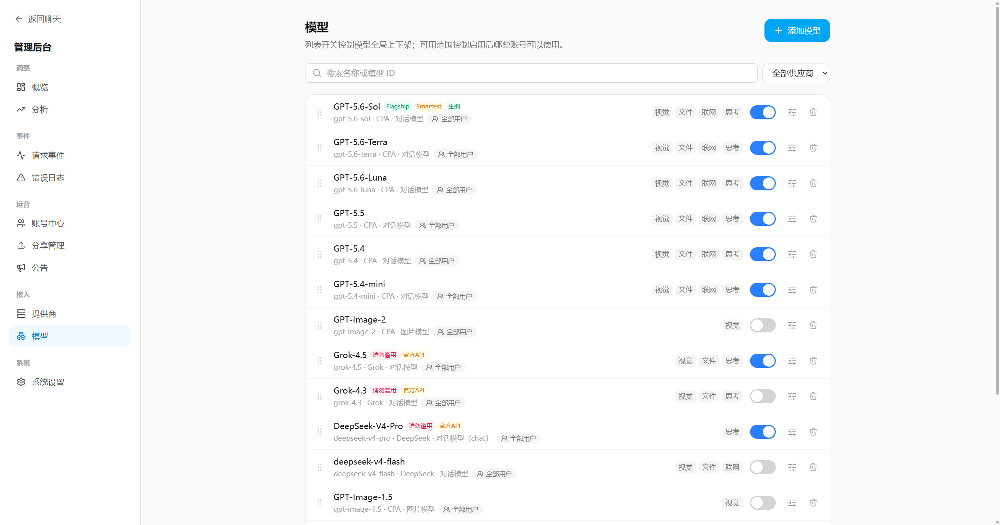

<div align="center">


**开源、可自托管的全功能 AI 聊天站**

服务端统一代理多家上游模型（OpenAI **Responses API** 与 **chat/completions**），实时流式回传浏览器，
内置断线续传、对话分支、思考模型、联网搜索、图片生成与完整管理后台。

[](https://nodejs.org/)
[](https://www.typescriptlang.org/)
[](https://react.dev/)
[](https://vite.dev/)
[](https://tailwindcss.com/)
[](https://hono.dev/)
[](https://www.sqlite.org/)

[✨ 功能特性](#-功能特性) · [🚀 快速开始](#-快速开始) · [📸 界面预览](#-界面预览) · [🏗️ 技术架构](#%EF%B8%8F-技术架构) · [📦 生产部署](#-生产部署)

<br>

<picture>
  <source media="(prefers-color-scheme: dark)" srcset="docs/assets/home-dark.png">
  
</picture>

*浅色 / 深色 / 跟随系统 · 七种可选重点色 · 全界面简体中文 · 桌面与手机全面适配*

</div>

---

## 🌟 为什么选 HappyChat？

- **精心设计的 UI**：界面美观现代，交互经过反复打磨，浅色 / 深色 / 移动端全面适配；博采 ChatGPT 与 Gemini 官网之长，取其精华、去其糟粕。
- **一切配置都在管理面板里完成**：接入上游、同步模型、定价、思考等级、权限、公告……全部在直观易用的后台界面点选即可，实时生效。
- **开箱即用的完整产品**：邀请码注册、多账号、权限、分享、公告、统计、成本核算一应俱全，部署完成即可直接投入使用。
- **部署极简**：Node + SQLite，单端口即可跑完整应用。**不需要** Docker、PostgreSQL、Redis、独立 worker。
- **对上游极致兼容**：同时支持 OpenAI Responses API 与 chat/completions 两种协议，任何 OpenAI 兼容网关都能接入，还能从上游目录一键挑选模型。
- **细节丰富的聊天体验**：断线续传、对话分支、提示词缓存优化、思考摘要、消息时间轴……大量精心打磨的交互细节。

## ✨ 功能特性

### 💬 聊天核心体验

- **实时流式输出**：文字逐段渐入，生成中可随时停止，失败一键重试
- **断线续传**：刷新页面 / 网络中断后自动重连，从上次位置继续接收未完成的生成
- **对话分支**：编辑用户消息后重发即形成会话内分支，随时在 `‹ 1/2 ›` 间切换；助手消息可重新生成；还能一键把「根消息 → 当前助手消息」整条链路复制为独立新对话
- **现代输入体验**：桌面端新对话输入框居中 + 重点色光晕，发出首条消息后平滑落底；单行 ⇄ 多行自适应、行扩展动画保证输入文字全程可见；图片 / 文件上传聚合进「＋」菜单；顶栏为模糊交叉渐变悬浮层
- **消息时间轴导航**（桌面端）：聊天右缘小横条随滚动高亮当前位置，悬停展开你发过的消息列表，点击快速跳转；可在设置中关闭
- **聊天文件夹与批量管理**：一键新建文件夹归类聊天；文件夹支持自定义颜色（预设色板 + 自定义取色）与 Emoji 图标（支持中文搜索的表情选择器，数据自托管、不依赖公网 CDN）、可置顶、展开状态记忆；批量模式下多选删除 / 移动；删除文件夹不删聊天
- **完整 Markdown 渲染**：GFM 表格、GitHub Alerts、LaTeX 公式（KaTeX）、代码高亮 + 一键复制、CJK 友好强调语法（粗体 / 斜体 / 删除线以中日韩标点结尾后可紧跟正文），且仅放行小范围安全 HTML

### 🧠 模型能力

- **双上游协议**：每个模型可配置走 Responses API 或 chat/completions —— 后者会被服务端翻译为统一事件流，前端零差异
- **思考模型完整支持**（GPT-5.6 等）：思考深度调节（none / low / medium / high / xhigh / max）+ 官方思考摘要实时展示；管理员可按模型自由增删、排序思考等级并自定义上游值与中文描述，不受前端枚举限制
- **加密推理上下文回传**（可选）：Responses 思考模型可开启「回传历史推理上下文」，`encrypted_content` 由服务端私有持久化并按来源严格门控重放 —— 密文绝不进入浏览器事件、消息 DTO 或分享快照
- **联网搜索**：一键开关 + 引用来源展示；思考 / 联网均为「临时一次 vs 固定默认」解耦设计，切换会话自动恢复各自上次使用的模型与参数
- **提示词缓存优化**：文本会话始终使用稳定 `prompt_cache_key`；每轮发送时间以隐藏的 runtime context 消息冻结重放，避免动态时间破坏历史前缀命中；缓存写入 / 读取 Token 分开计量、分别定价、独立展示
- **聚合模型选择器**：模型 / 思考深度 / 联网搜索（图片模型则是分辨率 / 画质）收进一个菜单 —— 思考深度分段选择 + 一键固定默认，分辨率带宽高比缩略图；模型列表直接显示管理员配置的标签（如「内测」「禁止滥用」），带描述的模型有 ⓘ 气泡（桌面悬浮 / 移动端点按）；桌面端在输入框内弹出，移动端为底部弹层
- **多模态输入输出**：图片输入、文件输入（内联 base64）、图片生成（GPT-Image-2，支持分辨率与画质选择）

### 🎨 个性化与细节

- **用户设置中心**：主题、重点色、字号、Enter 发送（桌面 / 手机分别配置）、自动滚动、消息时间 / 模型名 / Token（含缓存写入读取）· TPS · 耗时明细开关
- **可自定义重点色**：七种配色（默认 / 蓝 / 绿 / 黄 / 粉 / 橙 / 紫）一键切换，用户消息气泡、发送按钮、输入框光晕等聊天核心 UI 随之统一变色，浅色 / 深色模式下均经过独立调校
- **账号自助管理**：头像上传（**支持裁切**）、改密码、清空对话、删除账号
- **聊天标题自动总结**：标题模型与提示词管理员可配，浏览器标签页标题随会话标题逐字动态同步
- **提示词模板变量**：`{{current_date}}` / `{{current_user}}` 等，涉及时间的变量会智能提示其对缓存命中的影响
- **全简体中文界面**：浅色 / 深色 / 跟随系统三主题，手机端侧栏抽屉 + 触摸优化，全面可用

### 🔗 分享与公告

- **分享聊天**：快照式公开只读链接，可选是否显示名称 / 头像、可设有效期、可手动挑选要分享的消息与附件开关；用户在「我的分享」独立页面集中管理；管理员可全局或按用户开关分享能力并查看全部分享
- **站内公告系统**：管理员发布 Markdown 公告，四种级别（通知 / 更新 / 提醒 / 重要）× 三种触达渠道（通知中心铃铛 / 顶部横幅 / 强提示弹窗）；支持置顶、受众（全体 / 仅管理员）、定时发布与自动过期；强弹窗可配曝光次数上限并按用户记录；管理员可查看「谁已读」名单、一键重置已读再次推送

### 🛠️ 管理后台

> 现代化分组侧栏 + recharts 可视化，移动端同样可用。从接入上游到模型定价，所有配置均在界面内完成并实时生效，无需编辑任何配置文件。

| 模块 | 能力 |
| --- | --- |
| **概览** | 请求总数 / 成功率、Token 总量与缓存命中率、按模型定价的成本估算、RPM/TPM 实时负载、请求健康柱状图 |
| **分析** | Token 趋势（输入 / 输出 / 缓存写入 / 缓存读取 / 推理五维拆分）、请求数与成本曲线、分用户统计，供应商 / 模型 / 用户三级筛选 |
| **请求事件 / 错误日志** | 每次上游调用的完整事件与错误追踪，便于排障 |
| **账号中心** | 用户管理 + 邀请码生成 + 会话管理（首位注册用户自动成为管理员） |
| **供应商** | OpenAI 兼容上游接入，测试连接、一键同步、**从上游目录挑选添加模型** |
| **模型** | **拖拽排序**、标签与描述、**同 id 多实例**、手动添加、独立定价、请求体硬参数 JSON 覆写、思考等级拖拽排序 + 行内默认值、**按模型指定可用用户** |
| **分享管理** | 全局 / 按用户开关，查看与管理全部分享链接 |
| **公告** | 发布、定时、过期、已读名单、重置推送 |
| **系统设置** | 标题总结模型与提示词（默认已填好，可直接改）等全局配置 |

## 📸 界面预览

<table>
  <tr>
    <td width="50%">
      
      <p align="center"><b>思考摘要 + 联网搜索</b><br><sub>实时展开模型的思考过程与逐条检索动作</sub></p>
    </td>
    <td width="50%">
      
      <p align="center"><b>深色模式</b><br><sub>文件夹归类 + Emoji 图标 + 置顶会话</sub></p>
    </td>
  </tr>
  <tr>
    <td width="50%">
      
      <p align="center"><b>后台概览</b><br><sub>请求健康、Token、成本估算、RPM/TPM 一屏总览</sub></p>
    </td>
    <td width="50%">
      
      <p align="center"><b>用量分析</b><br><sub>Token 五维趋势 / 请求数 / 成本曲线，可按供应商·模型·用户筛选</sub></p>
    </td>
  </tr>
  <tr>
    <td colspan="2">
      
      <p align="center"><b>模型管理</b><br><sub>拖拽排序 · 能力标记 · 自定义标签 · 上下架开关 · 按用户授权</sub></p>
    </td>
  </tr>
</table>

## 🚀 快速开始

本地开发（Windows 亦可直接运行，无需 WSL / Docker）：

```bash
npm install
cp .env.example .env        # 可按需修改端口、数据目录、数据库路径；开发环境 SESSION_SECRET 可留空
npm run dev                 # 同时启动后端(8787)与前端(5173)
```

打开 `http://localhost:5173`：

1. **注册管理员** —— 首次访问时注册页会提示「首位用户将成为管理员」，无需邀请码。
2. **接入上游** —— 进入「管理后台 → 提供商」，添加 OpenAI 兼容上游（Base URL + API Key），点「测试连接」「同步模型」。
3. **配置模型** —— 在「模型」页按需调整能力、默认参数、思考等级（值与中文描述均可自定义）；Responses 思考模型还可开启「回传历史推理上下文」。
4. **邀请朋友** —— 在「邀请码」页生成邀请码，分享给朋友注册。

也可分别运行：`npm run dev:server` / `npm run dev:web`。

### 自检脚本

```bash
npm run typecheck     # 前后端类型检查
npm run lint          # ESLint
npm run test          # Vitest 单元测试
```

`scripts/` 下还有一套基于 Playwright 的端到端冒烟脚本（流式、续传、分支、思考、联网、图片输入、图片生成、Markdown、管理后台、侧栏搜索、文件夹与批量管理、全模型冒烟），先 `npm run dev` 起站后用 `npx tsx scripts/<name>.ts` 运行。

## 🏗️ 技术架构

| 层 | 选型 |
| --- | --- |
| 前端 | Vite · React · TypeScript · Tailwind v4 · TanStack Query · Zustand · recharts |
| 后端 | Hono · Node.js（`tsx` 运行） |
| 数据 | SQLite（WAL）· Drizzle ORM · 本地文件存储 |
| 流式 | SSE 流式输出 + 断线续传（进程内 RunManager + `run_events` 事件持久化） |

```
happychat/
├── shared/    # 前后端共享类型与 zod schema —— 一处定义，两端校验
├── server/    # Hono 后端：鉴权、上游代理、SSE、管理 API
├── web/       # React 前端
└── scripts/   # Playwright 端到端冒烟脚本
```

单仓库（非 monorepo）、单进程、单端口。刻意**不依赖** Next.js、独立 worker、PostgreSQL、Redis、Docker，尽量降低部署与运维复杂度。

> [!TIP]
> 虽然当前使用 SQLite，但 Drizzle schema 刻意保持 PostgreSQL 可迁移（JSON 文本、整型时间戳、无 SQLite 专有特性），为未来迁移预留了空间。

## 📦 生产部署

### 构建与运行

```bash
npm run build         # 构建前端到 dist/web
NODE_ENV=production npm run start
```

生产模式下后端直接静态托管 `dist/web`（含 SPA 回退），**单端口**（默认 8787）即可提供完整应用。数据库迁移在启动时自动执行。

> [!IMPORTANT]
> 生产环境必须设置高强度的 `SESSION_SECRET`，否则启动会被拒绝。

### Ubuntu 部署示例

```bash
# 需 Node 20+（推荐 22/24）
git clone <repo> && cd happychat
npm ci
npm run build

# .env（生产）
cat > .env <<'EOF'
NODE_ENV=production
PORT=8787
DATA_DIR=./data
DATABASE_URL=./data/happychat.db
SESSION_SECRET=<openssl rand -hex 32>
EOF

npm run start
```

用 systemd 常驻：

```ini
# /etc/systemd/system/happychat.service
[Unit]
Description=happychat
After=network.target

[Service]
WorkingDirectory=/opt/happychat
ExecStart=/usr/bin/npm run start
Restart=always
EnvironmentFile=/opt/happychat/.env

[Install]
WantedBy=multi-user.target
```

### nginx 反向代理

> [!WARNING]
> SSE 路由必须关闭缓冲，否则流式输出会被反向代理缓冲，无法逐段到达浏览器。

```nginx
location /api/ {
    proxy_pass http://127.0.0.1:8787;
    proxy_http_version 1.1;
    proxy_set_header Connection '';
    proxy_buffering off;          # 关键：SSE 流式不被缓冲
    proxy_cache off;
    proxy_read_timeout 3600s;
}
location / {
    proxy_pass http://127.0.0.1:8787;
}
```

浏览器缓存策略由应用统一返回，反向代理**不要覆盖** `Cache-Control`：

- HTML（含 `/` 与所有 SPA 回退路由）使用 `no-cache`，每次打开都会确认最新入口；
- Vite 生成的 `/assets/*` 内容哈希资源使用一年 `immutable` 缓存；
- 已被新构建删除的旧哈希资源返回 404，不会错误回退为 `index.html`。

### 数据与备份

所有数据都在 `data/` 目录：`happychat.db`（SQLite）+ `uploads/`（图片 / 文件 / 生成图）。备份时直接复制该目录即可。

上传成功但未随消息发送的附件会保留至少 24 小时；服务启动时及此后每小时自动扫描清理，正常负载下约在上传后 24～25 小时删除数据库记录与磁盘文件。

## 📐 设计取舍

透明说明几个刻意的架构决策：

- **本地上下文重放**：每轮重发完整可见历史（上游 `store` 默认 false，不依赖 `previous_response_id`），保证换上游、换模型无缝。开启加密推理上下文重放时，仅在 Provider / Base URL / 上游模型 id 全匹配时注入，单轮超过 256KB 自动放弃保存 —— 代价是请求体与输入 Token 会增大。
- **进程内续传**：续传基于进程内 RunManager + `run_events` 持久化；进程重启会把未完成的生成标记为「已中断」。这是用「无 worker / 无 Redis」换来的简单性。
- **附件内联 base64**：跳过 Files API 直接内联发送，最大化 OpenAI 兼容网关的适配面；遵循 OpenAI 限制（单文件 < 50MB、单次请求合计 ≤ 50MB），base64 膨胀与长上下文会相应增大请求体。

---

<div align="center">

**如果这个项目对你有帮助，点个 ⭐ Star 支持一下吧！**

<sub>Made with ❤️ · 欢迎 Issue 与 PR</sub>

</div>
