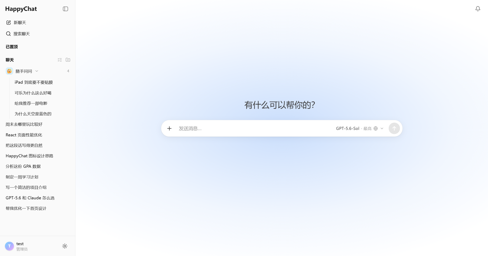
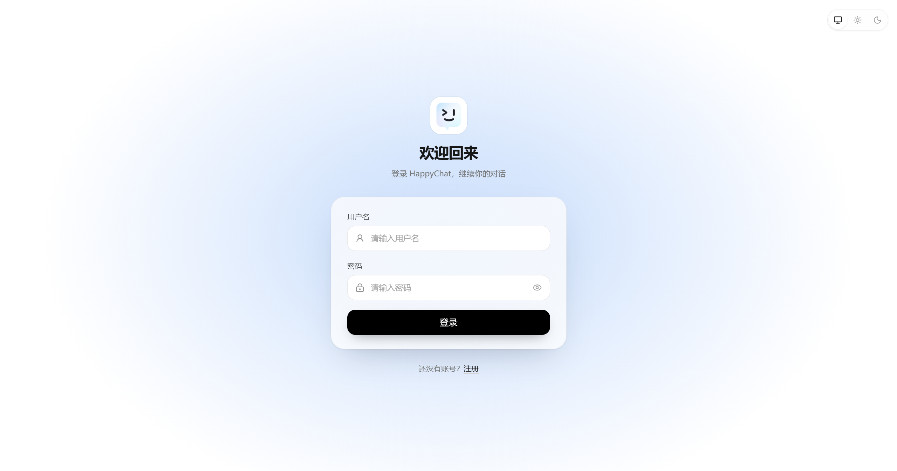
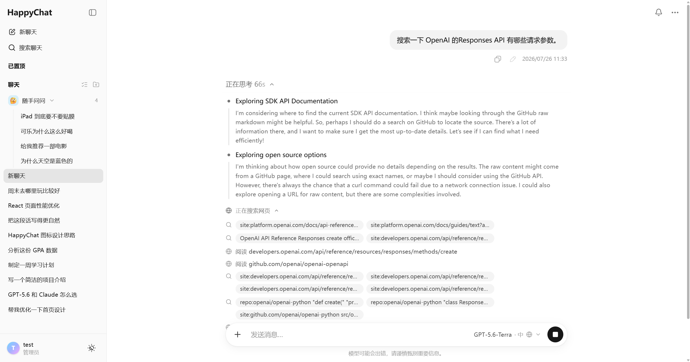
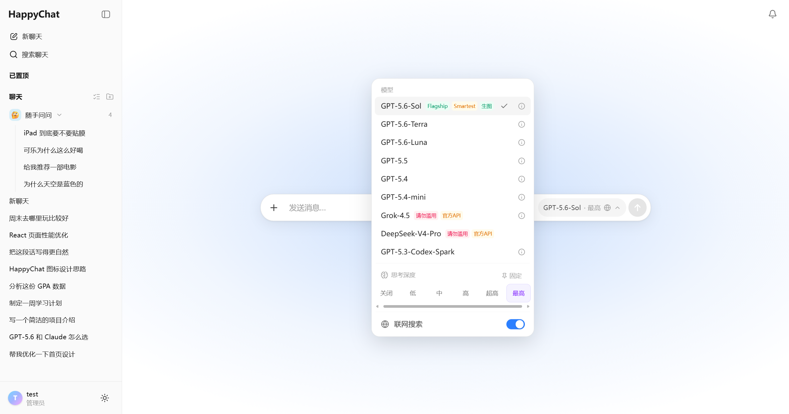
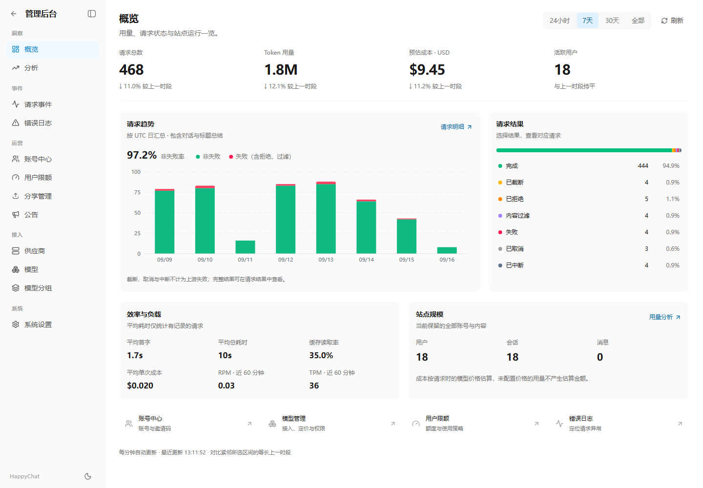
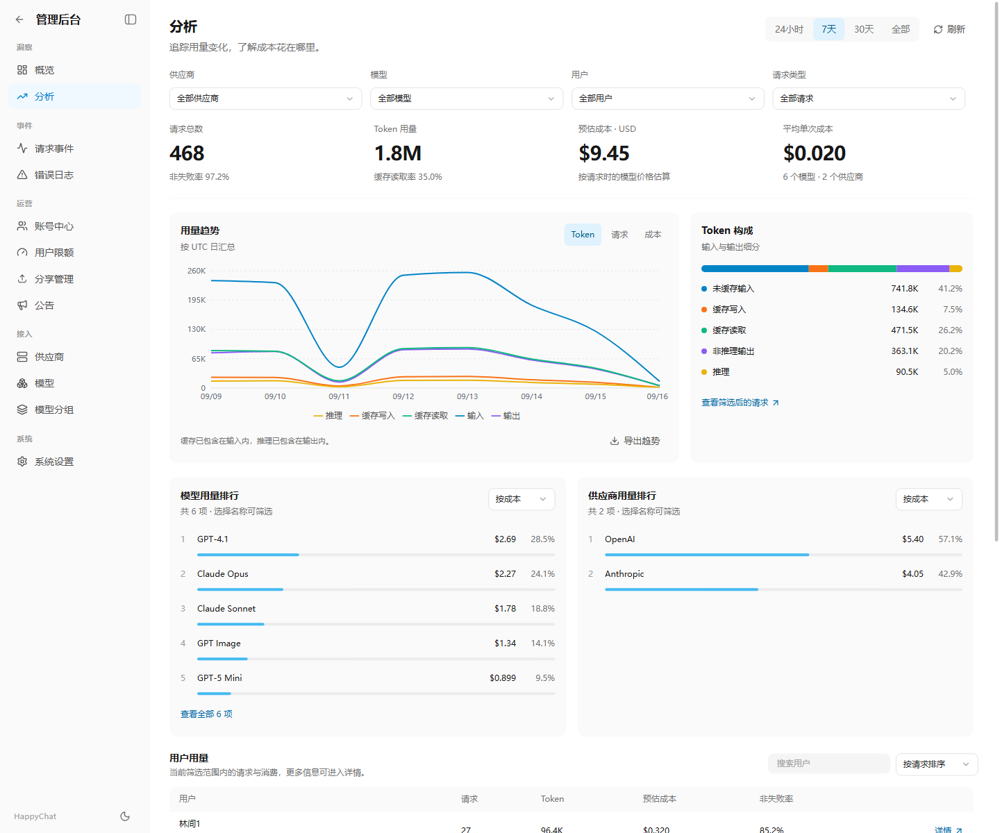
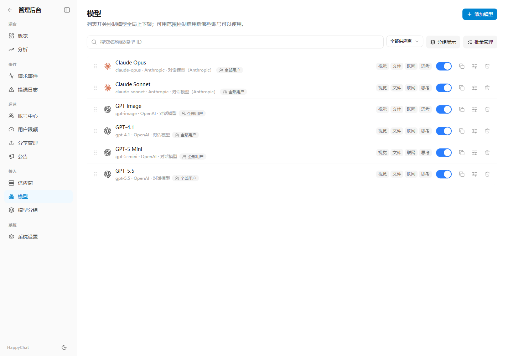

<div align="center">

<picture>
  <source media="(prefers-color-scheme: dark)" srcset="docs/assets/logo-dark.png">
  
</picture>

**开源、可自托管的全功能 AI 聊天站**

服务端统一代理多家上游模型（OpenAI **Responses API / chat/completions** 与 Anthropic **Messages API**），实时流式回传浏览器，
内置断线续传、对话分支、思考模型、联网搜索 / X 搜索、图片生成与完整管理后台。

[](https://nodejs.org/)
[](https://www.typescriptlang.org/)
[](https://react.dev/)
[](https://vite.dev/)
[](https://tailwindcss.com/)
[](https://hono.dev/)
[](https://www.sqlite.org/)

[✨ 功能特性](#-功能特性) · [🚀 快速开始](#-快速开始) · [📸 界面预览](#-界面预览) · [🏗️ 技术架构](#%EF%B8%8F-技术架构) · [📦 生产部署](#-生产部署)

<br>

<picture>
  <source media="(prefers-color-scheme: dark)" srcset="docs/assets/home-dark.png">
  
</picture>

_浅色 / 深色 / 跟随系统 · 七种可选重点色 · 全界面简体中文 · 桌面与手机全面适配_

</div>

---

## 🌟 为什么选 HappyChat？

- **精心设计的 UI**：界面美观现代，交互经过反复打磨，浅色 / 深色 / 移动端全面适配；博采 ChatGPT 与 Gemini 官网之长，取其精华、去其糟粕。
- **一切配置都在管理面板里完成**：接入上游、同步模型、定价、思考等级、权限、公告……全部在直观易用的后台界面点选即可，实时生效。
- **开箱即用的完整产品**：可配置的邀请码注册、多账号、权限、分享、公告、统计、成本核算一应俱全，部署完成即可直接投入使用。
- **部署极简**：Node + SQLite，单端口即可跑完整应用。**不需要** Docker、PostgreSQL、Redis、独立 worker。
- **对上游极致兼容**：同时支持 OpenAI Responses API、chat/completions 与 Anthropic Messages 原生协议；兼容网关和 Anthropic 官方服务都能接入，还能从上游目录一键挑选模型。
- **细节丰富的聊天体验**：断线续传、对话分支、提示词缓存优化、思考摘要、消息时间轴……大量精心打磨的交互细节。

## ✨ 功能特性

### 💬 聊天核心体验

- **实时流式输出**：文字逐段渐入，生成中可随时停止，失败一键重试
- **断线续传**：刷新页面 / 网络中断后自动重连，从上次位置继续接收未完成的生成
- **对话分支**：编辑消息不会覆盖原内容，而是在该位置创建子分支，可随时在 `‹ 1/2 ›` 间切换；还能一键把「根消息 → 当前助手消息」整条链路复制为独立新对话
- **现代输入体验**：桌面端新对话输入框居中 + 重点色光晕，发出首条消息后平滑落底；单行 ⇄ 多行自适应、行扩展动画保证输入文字全程可见；图片 / 文件上传聚合进「＋」菜单；顶栏为模糊交叉渐变悬浮层
- **消息时间轴导航**（桌面端）：聊天右缘小横条随滚动高亮当前位置，悬停展开你发过的消息列表，点击快速跳转；可在设置中关闭
- **聊天文件夹与批量管理**：一键新建文件夹归类聊天；文件夹支持自定义颜色（12 色柔和浅色预设 + 自定义取色）与 Emoji 图标（支持中文搜索的表情选择器，数据自托管、不依赖公网 CDN）、可置顶、展开状态记忆；批量模式下多选删除 / 移动；删除文件夹不删聊天
- **完整 Markdown 渲染**：GFM 表格、GitHub Alerts、LaTeX 公式（KaTeX）、代码高亮 + 一键复制、CJK 友好强调语法（粗体 / 斜体 / 删除线以中日韩标点结尾后可紧跟正文），且仅放行小范围安全 HTML

### 🧠 模型能力

- **三种上游协议**：供应商先决定 OpenAI 兼容或 Anthropic Messages 协议；OpenAI 兼容供应商的模型可选 Responses API / chat/completions，Anthropic 供应商的模型固定走 Messages API。服务端统一翻译成同一事件流，前端零差异
- **思考模型完整支持**（GPT-5.6、Claude Sonnet 5 等）：精致的交互界面一键调节思考深度（none / low / medium / high / xhigh / max）+ 实时展示官方推理摘要；管理员可按模型自由增删、排序思考等级并自定义上游值与中文描述，不受前端枚举限制
- **提供商私有上下文回传**（可选）：Responses 的 `encrypted_content`，以及 Anthropic 的 thinking 签名、`redacted_thinking`、搜索密文与引用索引，都只在服务端按来源严格门控并原样重放——绝不进入浏览器事件、消息 DTO 或分享快照
- **联网搜索 / X 搜索**：一键开关 + 引用来源展示；支持 Responses web search 与 Anthropic 原生 web search（含 `pause_turn` 续跑和搜索错误状态）；X 搜索（xAI `x_search`）检索 X（原 Twitter）站内的帖子、讨论串与用户。检索过程按真实交错顺序展示在同一张状态卡里
- **提示词缓存优化**：OpenAI 文本会话使用稳定 `prompt_cache_key`，Anthropic 使用高级 JSON 中明确可见的 `cache_control`；每轮发送时间以 runtime context 冻结重放；缓存写入 / 读取 Token 分开计量、分别定价、独立展示
- **聚合模型选择器**：模型 / 思考深度 / 联网搜索 / X 搜索（图片模型则是分辨率 / 画质）收进一个菜单 —— 思考深度分段选择 + 一键固定默认，分辨率带宽高比缩略图；模型列表直接显示品牌图标与管理员配置且可自定义颜色的标签（如「内测」「禁止滥用」），带描述的模型有 ⓘ 气泡（桌面悬浮 / 移动端点按）；桌面端在输入框内弹出，移动端为底部弹层
- **模型分组与两种视图**：管理员可新建分组、拖拽排序、批量把模型移入；用户侧可自由切换 **平铺视图**（分组标题可折叠）与 **二级目录视图**（先选分组再钻取模型），选择记在账户里；模型多时列表内还有搜索框，未配置分组的站点则与从前完全一致
- **模型 / 分组图标**：内置 900+ AI 品牌图标（[lobe-icons](https://github.com/lobehub/lobe-icons)，**随应用自托管，不依赖公网 CDN**），也可上传自定义图标或直接用 Emoji；分组还能显式设为**无图标**，标题像「未分组」一样直接左对齐。内置搜索支持中文品牌名、全拼与英文。未配置时按模型 ID **自动识别品牌图标**，管理端还能批量识别并套用；即使识别成功，也可显式改用名称首字母。单色图标经 CSS mask 渲染，浅色 / 深色下均自动适配
- **多模态输入输出**：图片输入、文件输入（OpenAI 文件格式；Anthropic 原生图片、PDF 与纯文本 document block）、图片生成（GPT-Image-2，支持分辨率与画质选择）

### 🎨 个性化与细节

- **用户设置中心**：主题、重点色、字号、Enter 发送（桌面 / 手机分别配置）、自动滚动、消息时间 / 模型名 / Token（含缓存写入读取）· TPS · 耗时明细开关；管理员还可全局决定是否展示单次预估成本，并选择 USD 或按实时汇率换算的 CNY（仅影响聊天消息用量行，成本为 0 时不显示）
- **可自定义重点色**：七种配色（默认 / 蓝 / 绿 / 黄 / 粉 / 橙 / 紫）一键切换，用户消息气泡、发送按钮、输入框光晕等聊天核心 UI 随之统一变色，浅色 / 深色模式下均经过独立调校
- **账号自助管理**：头像上传（**支持裁切**）、改密码、清空对话、删除账号
- **聊天标题自动总结**：标题模型与提示词管理员可配，浏览器标签页标题随会话标题逐字动态同步
- **提示词模板变量**：`{{current_date}}` / `{{current_user}}` 等，涉及时间的变量会智能提示其对缓存命中的影响
- **全简体中文界面**：浅色 / 深色 / 跟随系统三主题，登录 / 注册页未登录时也能切换（偏好仅存本地）；手机端侧栏抽屉 + 触摸优化，全面可用

### 📊 用量与限额

- **用户限额**：管理员用「策略模板 + 用户单独覆写」控制每个人的用量——例如「默认用户：$10/月」「VIP：$100/月」「朋友：不限额」「测试账号：$2/天」；张三可以继承默认策略但把月上限单独改成 $30，不必逐人维护完整配置
- **多条件与多口径**：同一策略内可并存多条规则（如「每月最多 $30 且每天最多 300 次」），任意一条触顶即拦截；计量支持**消费金额（USD）**或**请求次数**，范围支持全部模型 / 指定模型 / 模型分组，且可选「每个目标各自独立额度」或「所选目标共享一个额度池」
- **优先级与例外放行**：每条规则可设优先级（数字越大越优先）。一个模型只受「命中它的最高优先级」那一档规则约束，所以「OpenAI 分组整体 $30/月，但组内 mini 不限额」只要两条规则，不必枚举组内其他模型——以后往组里加新模型也会自动落入分组限额
- **周期与重置**：自然日 / 周 / 月自动重置（边界时区与周起始日可配）；另有两种按小时窗口——**首次请求起算的固定周期**（空闲时不计时，到期整段清零）与**真实滚动窗口**（始终统计过去 N 小时、旧用量逐步释放），也支持永久累计
- **豁免而不是大数字**：「不限额」是显式状态而不是一个很大的数字；配合更高的优先级即可把个别模型从大范围规则里放行
- **按模型精细拦截**：某个模型额度耗尽只禁用该模型，选择器里标记「额度已用尽」，其他仍有额度的模型照常可用
- **临时增加额度**：给某人本周期临时加 $5（$10 → $15），周期结束自动失效，不污染长期配置；也可手动重置当前周期——既能一键重置全部，也能只重置某一个模型/分组的额度（只抬高统计起点，历史用量与后台统计不受影响）
- **暂停 / 恢复限额**：临时放行某个用户，期间用量照常累计，恢复后立即按累计值重新判定
- **额度预警**：接近上限或已耗尽时在输入框上方给出提示条，说明用了多少、何时重置、能否换模型
- **个人使用情况面板**（`/usage`）：可按**今日 / 本周 / 本月 / 本年**切换统计窗口（趋势图粒度随之变为小时 / 天 / 月），看请求数、Token、花费、新建对话与消息、按模型的用量构成、一天与一周中的活跃分布，以及自己的额度进度；另有一张恒为「近一年」的 GitHub 贡献图风格活跃热力图
- **标题总结单独记账**：会话标题的后台调用仍进入「请求事件」与真实成本统计，但不计入任何用户额度规则，也不会启动“首次请求起算”的固定周期
- **随时开关**：限额总开关关闭后不做任何判定、用户端完全看不到额度信息，而策略配置与用量计数完整保留，重新打开即恢复

### 🔗 分享、导出与公告

- **分享聊天**：快照式公开只读链接，可选是否显示名称 / 头像、可设有效期、可手动挑选要分享的消息与附件开关；用户在「我的分享」独立页面集中管理；管理员可全局或按用户开关分享能力并查看全部分享
- **导出聊天**：六种格式一键导出——chatlog-md 对话日记（遵循 [chatlog-md/1 规范](https://github.com/happycola233/dialogary/blob/main/chatlog-md-%E6%A0%BC%E5%BC%8F%E8%A7%84%E8%8C%83.md)，适合长期保存与程序解析）、Markdown、自包含 HTML 网页（附件内联、双主题）、JSON 全量数据（可含完整分支树）、JSONL（OpenAI messages，适合微调数据集）、纯文本；支持消息逐条挑选或快捷选择全部消息 / 全部用户消息 / 全部 AI 回复，思考摘要 / 模型名 / 引用来源 / 检索过程 / Token 用量逐项开关，时间精度四档，附件三种模式（打包 ZIP + assets · 仅文件名 · 不包含）；弹窗内实时预览导出效果；侧栏批量模式可多选一键批量导出
- **站内公告系统**：管理员发布 Markdown 公告，四种级别（通知 / 更新 / 提醒 / 重要）× 三种触达渠道（通知中心铃铛 / 顶部横幅 / 强提示弹窗）；支持置顶、受众（全体 / 仅管理员）、定时发布与自动过期；强弹窗可配曝光次数上限并按用户记录；管理员可查看「谁已读」名单、一键重置已读再次推送

### 🛠️ 管理后台

> 现代化分组侧栏 + recharts 可视化，移动端同样可用。从接入上游到模型定价，所有配置均在界面内完成并实时生效，无需编辑任何配置文件。

| 模块                    | 能力                                                                                                                                                                                                                                                             |
| ----------------------- | ---------------------------------------------------------------------------------------------------------------------------------------------------------------------------------------------------------------------------------------------------------------- |
| **概览**                | 请求总数 / 成功率、Token 总量与缓存命中率、按请求时模型价格快照的成本估算（之后改价或删除模型不回算历史）、RPM/TPM 实时负载、请求健康柱状图                                                                                                                      |
| **分析**                | Token 趋势（输入 / 输出 / 缓存写入 / 缓存读取 / 推理五维拆分）、请求数与成本曲线、分用户统计，供应商 / 模型 / 用户三级筛选                                                                                                                                       |
| **请求事件 / 错误日志** | 每次上游调用的完整事件与错误追踪，便于排障                                                                                                                                                                                                                       |
| **账号中心**            | 用户管理 + 遗忘密码重置（随机临时密码、旧会话失效、首次登录强制改密）+ 邀请码生成 + 会话管理（首位注册用户自动成为管理员）                                                                                                                                       |
| **供应商**              | OpenAI 兼容 / Anthropic Messages 原生协议接入，测试连接、一键同步、**从上游目录挑选添加模型**                                                                                                                                                                    |
| **模型**                | **拖拽排序**、自定义标签文字与颜色、模型描述、**同 id 多实例**、手动添加、独立定价、请求体硬参数 JSON 覆写、思考等级拖拽排序 + 行内默认值、**按模型指定可用用户**、批量移入分组 / 批量识别图标                                                                   |
| **模型分组**            | 新建 / 重命名 / 删除 / **拖拽排序**；可选默认文件夹（可调颜色）、显式无图标或自定义图标；删除分组只把成员移回「未分组」，不会删除模型                                                                                                                            |
| **用户限额**            | 策略模板 CRUD / 复制 / 设为默认 / 拖拽排序；用户视图逐人完整展开全部额度桶，统一展示状态、用量 / 上限、临时额度与明确的周期 / 重置时间；支持批量修改策略、暂停或恢复限额、按桶或整体重置周期、临时赠送额度、逐规则覆写（含优先级）并在保存前**预览最终生效结果** |
| **分享管理**            | 全局 / 按用户开关，查看与管理全部分享链接                                                                                                                                                                                                                        |
| **公告**                | 发布、定时、过期、已读名单、重置推送                                                                                                                                                                                                                             |
| **系统设置**            | “注册需要邀请码”、“允许用户分享聊天”、“展示单次请求成本”开关，聊天成本展示币种（USD / CNY），以及标题总结模型与提示词（默认已填好，可直接改）等全局配置；限额总开关与周期口径在「用户限额」页                                                                    |

## 📸 界面预览

> 以下截图均会**跟随你的 GitHub 主题自动切换浅色 / 深色版本**。

<table>
  <tr>
    <td width="50%">
      <picture>
        <source media="(prefers-color-scheme: dark)" srcset="docs/assets/login-dark.png">
        
      </picture>
      <p align="center"><b>登录页</b><br><sub>精心打磨的第一印象：渐变光晕背景 + 圆角卡片，浅深主题独立调校</sub></p>
    </td>
    <td width="50%">
      <picture>
        <source media="(prefers-color-scheme: dark)" srcset="docs/assets/chat-reasoning-search-dark.png">
        
      </picture>
      <p align="center"><b>思考摘要 + 联网搜索</b><br><sub>完整解析上游推理与检索事件，思考摘要 / 搜索状态优雅实时呈现</sub></p>
    </td>
  </tr>
  <tr>
    <td width="50%">
      <picture>
        <source media="(prefers-color-scheme: dark)" srcset="docs/assets/model-picker-dark.png">
        
      </picture>
      <p align="center"><b>聚合模型选择器</b><br><sub>简洁易用的面板，一键调节模型、思考深度与联网开关</sub></p>
    </td>
    <td width="50%">
      <picture>
        <source media="(prefers-color-scheme: dark)" srcset="docs/assets/admin-overview-dark.png">
        
      </picture>
      <p align="center"><b>后台概览</b><br><sub>请求健康、Token、成本估算、RPM/TPM 一屏总览</sub></p>
    </td>
  </tr>
  <tr>
    <td width="50%">
      <picture>
        <source media="(prefers-color-scheme: dark)" srcset="docs/assets/admin-analytics-dark.png">
        
      </picture>
      <p align="center"><b>用量分析</b><br><sub>Token 五维趋势 / 请求数 / 成本曲线，可按供应商·模型·用户筛选</sub></p>
    </td>
    <td width="50%">
      <picture>
        <source media="(prefers-color-scheme: dark)" srcset="docs/assets/admin-models-dark.png">
        
      </picture>
      <p align="center"><b>模型管理</b><br><sub>拖拽排序 · 能力标记 · 自定义标签 · 上下架开关 · 按用户授权</sub></p>
    </td>
  </tr>
</table>

## 🚀 快速开始

本地开发（Windows 亦可直接运行，无需 WSL / Docker）：

```bash
npm install
cp .env.example .env        # 可按需修改端口、数据目录、数据库路径；开发环境 SESSION_SECRET 可留空
npm run dev                 # 同时启动后端(8787)与前端(5173)
```

打开 `http://localhost:5173`：

1. **注册管理员** —— 首次访问时注册页会提示「首位用户将成为管理员」，无需邀请码。
2. **接入上游** —— 进入「管理后台 → 提供商」，先选择 OpenAI 兼容或 Anthropic Messages 原生协议，再填写 Base URL + API Key 并点「测试连接」「同步模型」。OpenAI 兼容地址通常带 `/v1`；Anthropic 可直接填官方根地址 `https://api.anthropic.com`，也兼容已带 `/v1` 的网关地址。
3. **配置模型** —— 在「模型」页按需调整能力、默认参数、思考等级（值与中文描述均可自定义）；Responses / Anthropic 思考模型还可开启「回传提供商私有上下文」。同步或手动选择 Anthropic Provider 时，默认参数栏会将必填的 `max_output_tokens` 预设为官方 thinking 指南使用的宽裕示例值 `16000`，发送时映射为 `max_tokens`；高级 JSON 则明示 thinking、缓存和 web search 模板，管理员删掉的模板不会被请求层暗中补回。
4. **邀请朋友** —— 默认情况下，后续用户需使用「邀请码」页生成的有效邀请码注册；如需开放注册，可在「系统设置」关闭“注册需要邀请码”。

也可分别运行：`npm run dev:server` / `npm run dev:web`。

### 自检脚本

```bash
npm run typecheck     # 前后端类型检查
npm run lint          # ESLint
npm run test          # Vitest 单元测试
```

`scripts/` 下还有一套基于 Playwright 的端到端冒烟脚本（流式、续传、分支、思考、联网、图片输入、图片生成、Markdown、管理后台、侧栏搜索、文件夹与批量管理、全模型冒烟），先 `npm run dev` 起站后用 `npx tsx scripts/<name>.ts` 运行。

## 🏗️ 技术架构

| 层   | 选型                                                                          |
| ---- | ----------------------------------------------------------------------------- |
| 前端 | Vite · React · TypeScript · Tailwind v4 · TanStack Query · Zustand · recharts |
| 后端 | Hono · Node.js（`tsx` 运行）                                                  |
| 数据 | SQLite（WAL）· Drizzle ORM · 本地文件存储                                     |
| 流式 | SSE 流式输出 + 断线续传（进程内 RunManager + `run_events` 事件持久化）        |

```
happychat/
├── shared/    # 前后端共享类型与 zod schema —— 一处定义，两端校验
├── server/    # Hono 后端：鉴权、上游代理、SSE、管理 API
├── web/       # React 前端
└── scripts/   # Playwright 端到端冒烟脚本
```

单仓库（非 monorepo）、单进程、单端口。刻意**不依赖** Next.js、独立 worker、PostgreSQL、Redis、Docker，尽量降低部署与运维复杂度。

> [!TIP]
> 虽然当前使用 SQLite，但 Drizzle schema 刻意保持 PostgreSQL 可迁移（JSON 文本、整型时间戳、无 SQLite 专有特性），为未来迁移预留了空间。

## 📦 生产部署

### 构建与运行

```bash
npm run build         # 构建前端到 dist/web
NODE_ENV=production npm run start
```

生产模式下后端直接静态托管 `dist/web`（含 SPA 回退），**单端口**（默认 8787）即可提供完整应用。数据库迁移在启动时自动执行。

> [!IMPORTANT]
> 生产环境必须设置高强度的 `SESSION_SECRET`，否则启动会被拒绝。

### Ubuntu 部署示例

```bash
# 需 Node 20+（推荐 22/24）
git clone https://github.com/happycola233/happychat && cd happychat
npm ci
npm run build

# .env（生产）
cat > .env <<'EOF'
NODE_ENV=production
PORT=8787
DATA_DIR=./data
DATABASE_URL=./data/happychat.db
SESSION_SECRET=<openssl rand -hex 32>
EOF

npm run start
```

用 systemd 常驻：

```ini
# /etc/systemd/system/happychat.service
[Unit]
Description=happychat
After=network.target

[Service]
WorkingDirectory=/opt/happychat
ExecStart=/usr/bin/npm run start
Restart=always
EnvironmentFile=/opt/happychat/.env

[Install]
WantedBy=multi-user.target
```

### nginx 反向代理

> [!WARNING]
> SSE 路由必须关闭缓冲，否则流式输出会被反向代理缓冲，无法逐段到达浏览器。

```nginx
location /api/ {
    proxy_pass http://127.0.0.1:8787;
    proxy_http_version 1.1;
    proxy_set_header Connection '';
    proxy_buffering off;          # 关键：SSE 流式不被缓冲
    proxy_cache off;
    proxy_read_timeout 3600s;
}
location / {
    proxy_pass http://127.0.0.1:8787;
}
```

浏览器缓存策略由应用统一返回，反向代理**不要覆盖** `Cache-Control`：

- HTML（含 `/` 与所有 SPA 回退路由）使用 `no-cache`，每次打开都会确认最新入口；
- Vite 生成的 `/assets/*` 内容哈希资源使用一年 `immutable` 缓存；
- 已被新构建删除的旧哈希资源返回 404，不会错误回退为 `index.html`。

### 数据与备份

所有数据都在 `data/` 目录：`happychat.db`（SQLite）+ `uploads/`（图片 / 文件 / 生成图）。备份时直接复制该目录即可。

上传成功但未随消息发送的附件会保留至少 24 小时；服务启动时及此后每小时自动扫描清理，正常负载下约在上传后 24～25 小时删除数据库记录与磁盘文件。

## 📐 设计取舍

透明说明几个刻意的架构决策：

- **本地上下文重放**：每轮重发完整可见历史（OpenAI 路径的 `store` 默认 false，不依赖 `previous_response_id`），保证换上游、换模型无缝。Responses 私有 reasoning item 单轮超过 256KB 时放弃保存；Anthropic 则原样保存完整 assistant content blocks，以延续后续用户轮次的 thinking 与联网搜索上下文。两者都只在 Provider / Base URL / 上游模型 id 完全匹配时注入，代价是数据库、请求体与输入 Token 随长对话增长；同一轮的 `pause_turn` 续跑由引擎直接处理，不受私有上下文开关影响。
- **进程内续传**：续传基于进程内 RunManager + `run_events` 持久化；进程重启会把未完成的生成标记为「已中断」。这是用「无 worker / 无 Redis」换来的简单性。
- **限额只按 USD 计量，且成本型额度事后判定**：用量成本统一以 USD 记账（聊天消息行的 CNY 展示只是按实时汇率换算的显示层），限额判定不引入任何汇率换算。额度用量全部从 `usage_logs` 实时聚合，不维护计数器，因此策略调整立即按新口径生效、与后台统计永不打架；代价是「消费金额」类额度只能在响应结束后才知道真实用量，剩余额度极少时仍会放行一次请求而小幅超支（请求次数类额度会把在途任务计入，不受此影响）。
- **附件内联 base64**：跳过 Files API 直接内联发送。OpenAI 路径按单文件 `<50MB`、合计 `≤50MB` 校验；Anthropic 图片仅支持 PNG/JPEG/GIF/WEBP 且单图 base64 后不超过 10MB，文件仅支持 PDF 与 `text/*`。完整 Messages JSON 会在发送前按 UTF-8 序列化后的实际字节执行 32MB 限制，历史文本、系统提示词、工具与私有上下文都计入。

---

<div align="center">

**如果这个项目对你有帮助，点个 ⭐ Star 支持一下吧！**

<sub>Made with ❤️ · 欢迎 Issue 与 PR</sub>

</div>
